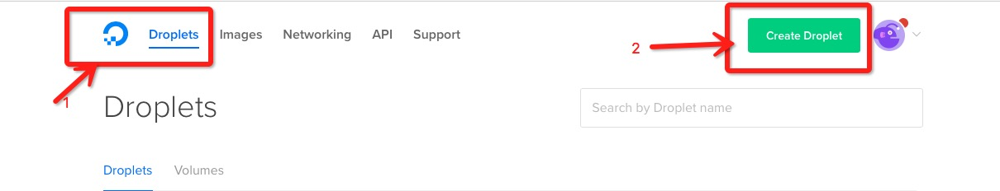
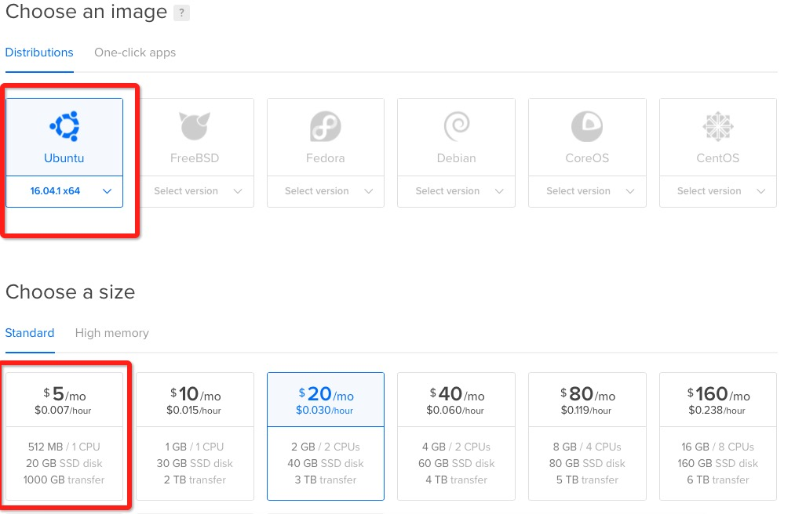
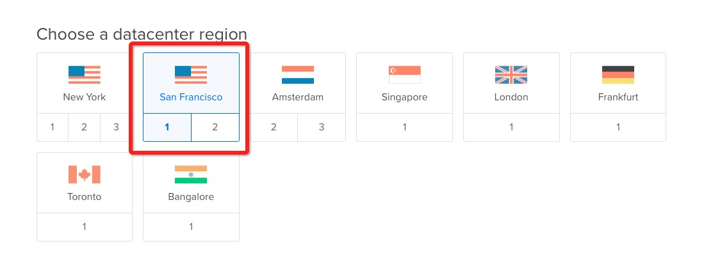
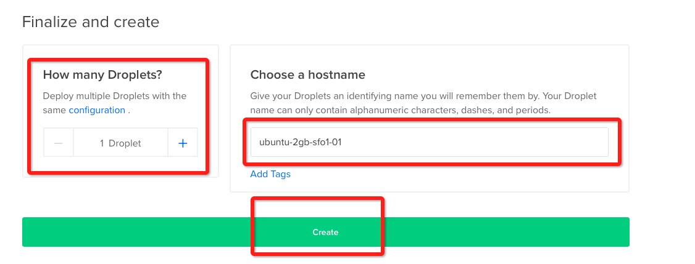
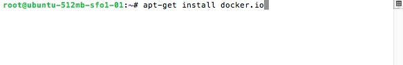
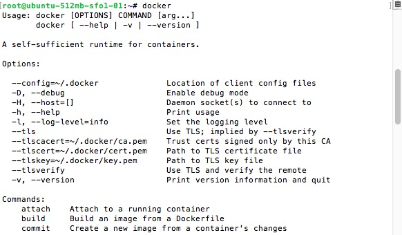
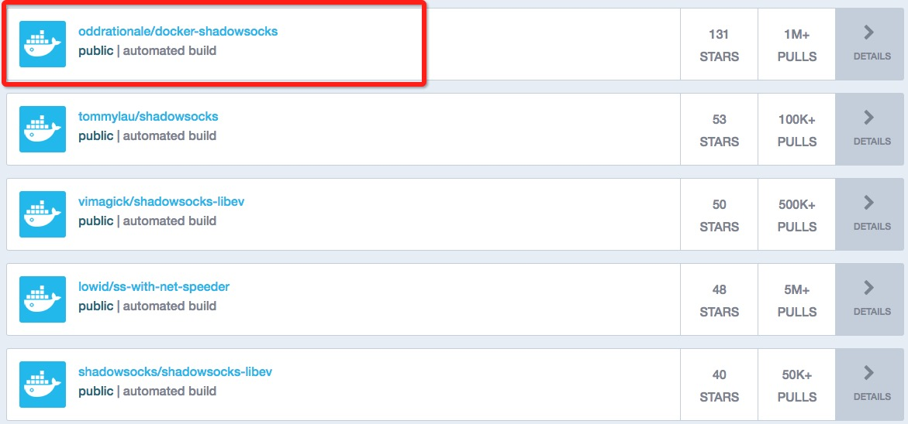
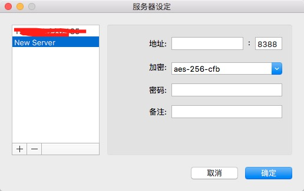
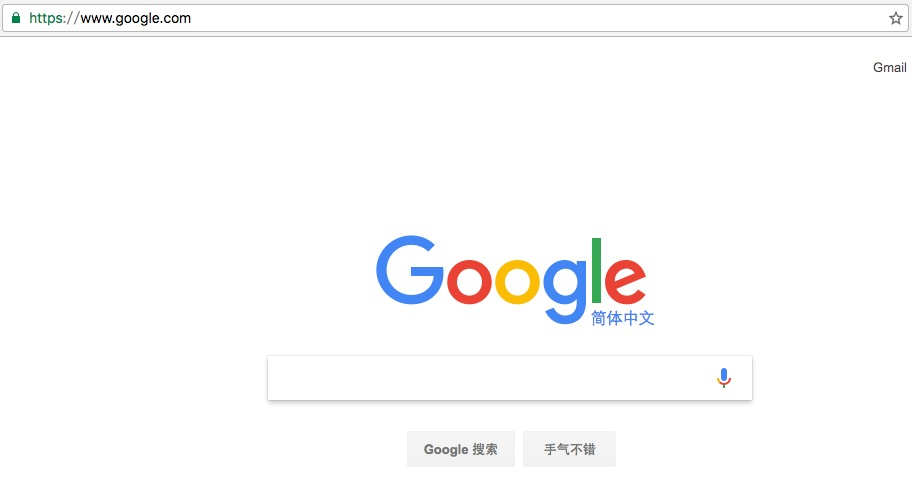

# vps-docker-实现科学上网
### 购买vps
1 先去[digitalocean](https://www.digitalocean.com/)购买一个vps,新用户可以领取一个$10的优惠券。  
2 成功登陆后登录，点击droplets->Create Droplet。

3 选择Ubantu,根据需要选取机器配置，我选择的是最便宜的$5的，512MB的cpu,20GB SSD，1000GB流量的vps。选择机房，可以选择San Francisco地区，这是旧金山的机房，速度比较快。 然后选择创建的Droplets个数以及hostname，点击Create。

4 创建成功后，digitalocean会给你发一封主机密码的邮件。  

### 配置vps+ Docker
1 windows下用xshell，mac/linux用户直接用自带的终端，ssh进入购买的vps。例如你的vps主机为192.168.8.88，`ssh root@192.168.8.88`命令，然后输入邮件收到的密码，进入主机。注意，第一次进入需要修改密码。  
2 然后进行docker的安装，输入命令`apt-get install docker.io`进行docker的安装，安装完后，输入在命令行下输入`docker`看是否安装成功。

  

### 配置科学上网镜像
#### 安装shadowsocks
1 首先去[Docker Hub](https://hub.docker.com/)搜索现有的镜像，你也可以自己制作镜像，这不在本篇教程之内。  
2 在搜索框输入shadowsocks，我是按照stars排序，用<https://hub.docker.com/r/oddrationale/docker-shadowsocks/>这个镜像。  

3 按照教程在输入以下命令`docker run -d -p 1984:1984 oddrationale/docker-shadowsocks -s 0.0.0.0 -p 1984 -k $SSPASSWORD -m aes-256-cfb`,参数意思 -d 表示后台运行，-p 表示端口映射，就是vps和镜像容器的端口映射，替换`$SSPASSWORD`为自己的密码，点击回车启动容器。  
4 初始化需要下载镜像和启动容器，需要大约1分钟左右，等待初始化完成后。输入`docker ps`查看容器是否启动成功。  

###客户端上网工具选择
1 推荐使用[shadowsocks](https://shadowsocks.org/en/download/clients.html)，下载相应的版本。  
2 以mac端为例，输入你的vps地址，以及端口，端口填写你容器的映射的端口，例如1984，填写密码。点击确定，打开浏览器，看是否实现了科学上网。 

#### vpn的安装
1 vpn的安装跟shadowsocks大同小异，从docker hub上找一个合适的镜像安装即可。  
2 **提醒** macOS Sierra已经不支持pptp协议的vpn，如果需要用自带的网络连接连接vpn，请选择支持L2TP的镜像，我推荐这个镜像<https://hub.docker.com/r/hwdsl2/ipsec-vpn-server/>。  
3 如果用PPTP协议的VPN的话，推荐这个镜像<https://hub.docker.com/r/mobtitude/vpn-pptp/>。

###全文完
